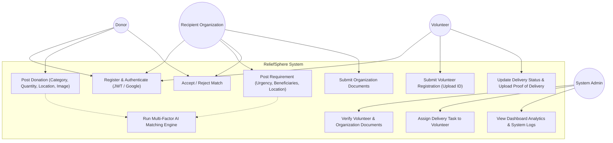
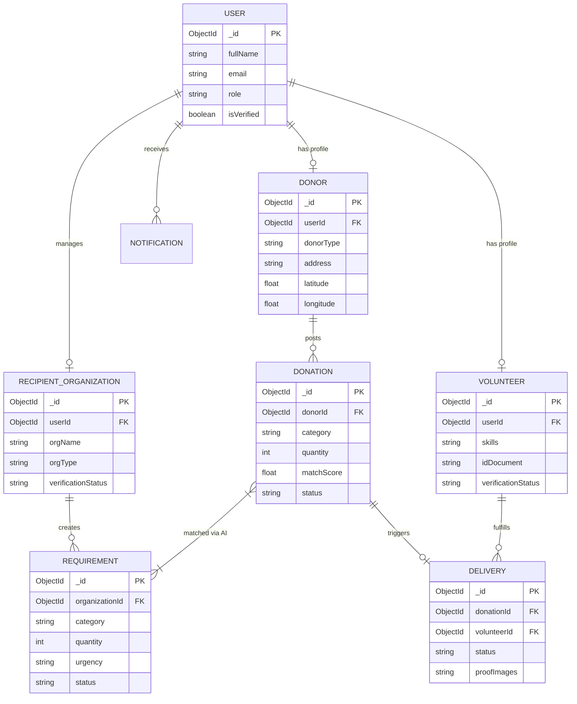
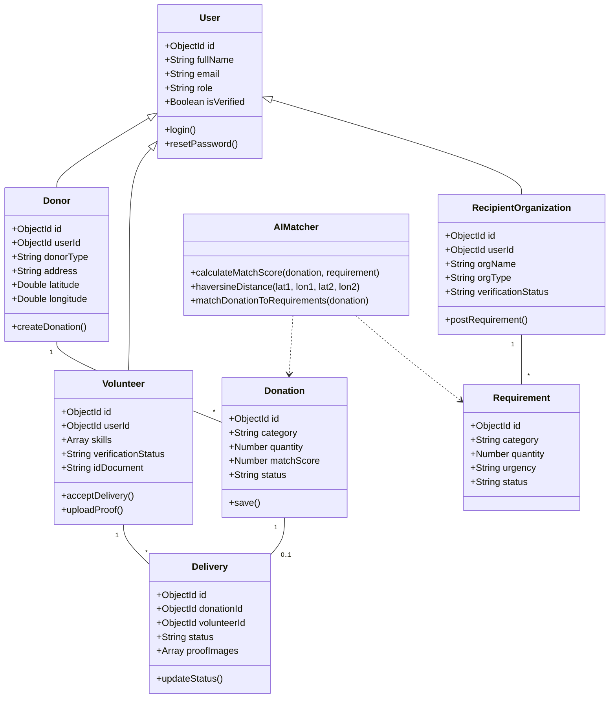
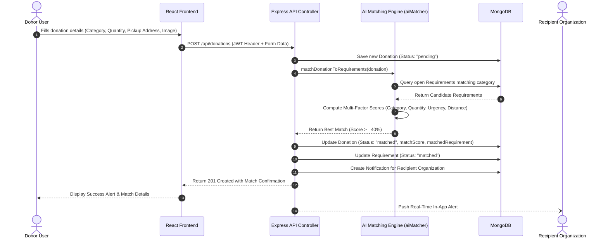
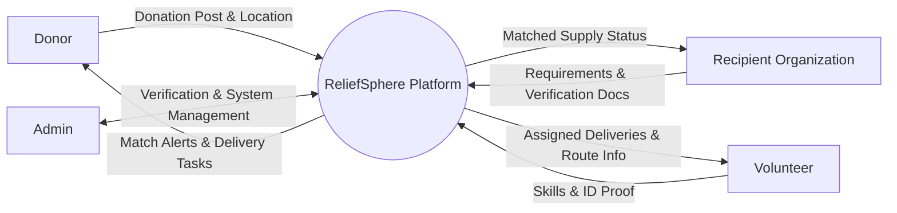
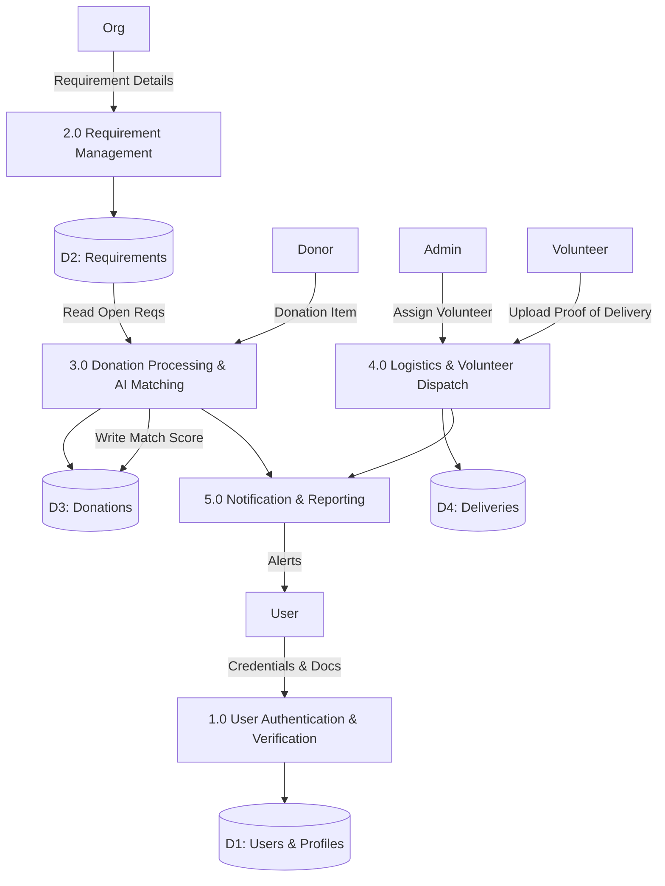

# UML DIAGRAMS & SYSTEM ARCHITECTURE
**Project:** ReliefSphere — Intelligent Resource Allocation & Disaster Relief Management Platform  
**Course Code:** 20INMCA509 — Mini Project 2  

---

## 1. Use Case Diagram

---

## 2. Entity Relationship (ER) Diagram

---

## 3. Class Diagram

---

## 4. Sequence Diagram: Donation Posting & Automated AI Matching

---

## 5. Data Flow Diagrams (DFD)

### 5.1 Level 0: Context Diagram

### 5.2 Level 1: System Data Flow Diagram

